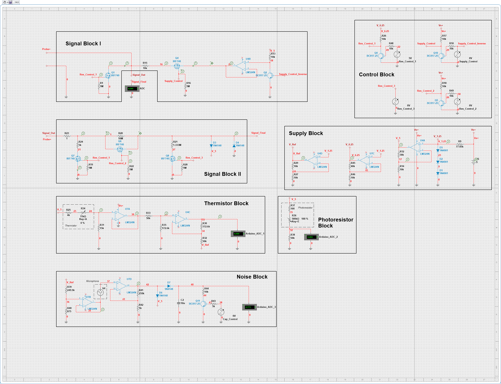

# Digital Multimeter

This is my final coursework for the subject "Introduction to Electrical and Computer Engineering" at the Free University of Tbilisi. It comprises of a digital multimeter circuit, which is controlled by an Arduino board and a rotary encoder, and uses an OLED display for the user interface.

## Technical Details

The multimeter is capable of several modes of operation, each of which is designed to measure a different aspect of the electrical characteristics of a circuit or the environmental conditions. Here are the supported modes:

* **Ohmmeter**: This mode measures the resistance in the circuit. The range of resistance that can be measured spans from 1 KΩ to 100 KΩ with an accuracy of at least 1KΩ.

* **Voltmeter**: This mode is capable of measuring the potential difference across components of the circuit (DC only). The measurement range extends from 0 V to 30 V, with an accuracy of at least 0.1V.

* **Ampermeter**: In this mode, the multimeter measures the current passing through the circuit (DC only). The measurement range is between 0 A and 10 A, with an accuracy of at least 0.1A.

* **Capacitance**: The multimeter can measure the capacitance of the circuit or individual capacitors. The range extends from 1 µF to 2500 µF with an accuracy of at least 1 µF.

* **Inductance**: This mode measures the inductance of the circuit or of individual inductors. The range of this measurement extends from 0 H to 100 µH, with an accuracy of at least 1 µH. The operation of this mode needs to be improved.

* **Temperature**: The multimeter can also measure ambient temperature, ranging from +15°C to +50°C with an accuracy of at least 0.1°C.

* **Light**: In this mode, the multimeter measures the ambient light in the room. The intensity measure is arbitrary, but is generally sensitive to the change of ambient light.

* **Noise**: The multimeter can measure the ambient noise in the room, ranging from 0 dB to 180 dB with an accuracy of at least 0.1dB. The operation of this mode needs to be improved.

A general circuit diagrame can be viewed below:

